# 3章 字句解析
## 問題1

P.47の図をなぞっていく。
LFの意味を理解するのに若干時間がかかったが、P.49を読めばわかる。
トークンになる状態に遷移したらLFを更新して、状態が0になった時のLFがそれまでスキャンした字句のトークンになる。

EOFかその他の記号で0にいく、がポイント。
2..2は2., .2がREALとして認識される。

^を教科書通りかけないので、<br>
: = posLF,LF<br>
' = posLF<br>
. = LF<br>
とする。 


状態    |LF     |入力列の状態   |注釈
--      |--     |--           |--
1       |0      |:2 . . 2    |
14      |14     | 2:. . 2    |
13      |13     | 2 .:. 2    |
13      |13     | 2 .:. 2    | 終了????

<br>

状態    |LF     |入力列の状態   |注釈
--      |--     |--           |--
1       |0      |:. . 2    |
15      |0      | .:. 2    |
15      |0      | .:. 2    | 終了????


## 問題2

(1)


## 問題3

(1)


# 4章 字句解析器生成系 lex
## 問題1

(1) : 

結果
```sh
number = 2, string '10b'  #BIN
number = 4, string ','    #COM
number = 3, string '23d'  #DEC
number = 4, string ','    #COM
number = 2, string '11'   ### BIN
number = 4, string ','    # COM
number = 3, string '03'   # DEC
```


(2) : 

結果
```sh
number = 2, string '10b'
number = 4, string ','
number = 3, string '23d'
number = 4, string ','
number = 3, string '11'   ### DEC
number = 4, string ','
number = 3, string '03'
```


考察:

(1)では[01]+の場合に、[0-9]+の前に優先してBINと判定していたが、
(2)では、[0-9]+を優先した。そのため、11がDECと判定された。
なお、lexで、[01]+が[0-9]+に包含される判定が入るのか、(2)ではlexのwarningが出るようになった。


e1-1.1
```c
%{
    enum {INT = 1, BIN, DEC, COM, ERR};
%}
%%
","         {return COM;  }
[01]+b      {return BIN;  }
[0-9]+d     {return DEC;  }
[01]+       {return BIN;  }
[0-9]+      {return DEC;  }
.           {return ERR;  }
%%
int yywrap(void){return 1;}
int main(void){
    int t;
    while((t=yylex()) != 0){
        printf("number = %d, string '%s'\n", t, yytext);
    }
}
```

```sh
lex -o e1-1.1.lex.yy.c e1-1.1
gcc e1-1.1.lex.yy.c
echo "10b,23d,11,03" | ./a.out 
```

e1-2.1
```c
%{
    enum {INT = 1, BIN, DEC, COM, ERR};
%}
%%
","         {return COM;  }
[01]+b      {return BIN;  }
[0-9]+d     {return DEC;  }
[0-9]+      {return DEC;  }
[01]+       {return BIN;  }
.           {return ERR;  }
%%
int yywrap(void){return 1;}
int main(void){
    int t;
    while((t=yylex()) != 0){
        printf("number = %d, string '%s'\n", t, yytext);
    }
}
```

```sh
lex -o e1-2.1.lex.yy.c e1-2.1
gcc e1-2.1.lex.yy.c
echo "10b,23d,11,03" | ./a.out 
```


## 問題2

適当なlex記述で自動生成ファイルの処理の概要を解説する。


## 問題3

字句解析を作れ。


## 問題4

(1)

```
a*b  {return AB;}
.    {return ERROR;}
```

試しにaaaaaを入れて見ると以下のように、エラーが続く。
```
aaaaaa aaaab bbbb 
number = 3, string 'a'
number = 3, string 'a'
number = 3, string 'a'
number = 3, string 'a'
number = 3, string 'a'
number = 3, string 'a'
number = 3, string ' '
number = 2, string 'aaaab'
number = 3, string ' '
number = 2, string 'b'
number = 2, string 'b'
number = 2, string 'b'
number = 2, string 'b'
number = 3, string ' '
```




(2)
入力aaaaは、ERROR ERROR ERROR ERRORと解釈される。

|     |                   |      |
|--   |--                 |--    |
|aaaa | 一文字目のaがERROR  | 4回  |
|aaa  | 一文字目のaがERROR  | 3回  |
|aa   | 一文字目のaがERROR  | 2回  |
|a    | 一文字目のaがERROR  | 1回  |

遷移回数は10回

(3)
上記から、aがn回連続する場合は、
n + n - 1 + n - 2 + ... + 1 = (n+1) * n / 2 で、n^2に比例する。 