# 3章 字句解析

## 章のまとめ

- トークン

  ソースプログラムを構成する語彙(lexicon)、単語(word)に相当するもの。整数、変数名等を、tokenとする。
  教科書では、変数名、関数名、ユーザー定義型名をID、整数をNUM, 四則演算をADD, SUB, MUL, DIV等よんでいる。

- 正則表現(regular expression)とオートマトン

  トークンの定義を、正則表現を用いて定義する。正則表現で生まれる曖昧を、最長一致、規則の優先順位で解決している。
  オートマトンは、ε動作を含む非決定性有限状態オートマトンと、決定性有限状態オートマトンの説明。
  ε動作の説明は、以下でなんとなくわかった気になれた。

  https://www.jaist.ac.jp/~uehara/course/2011/ti118/08fam.pdf

  本書でこの非決定性有限状態オートマトンの説明をする意図が理解できず。。。
   トークン解析のために決定性オートマトン
   - 各状態で各文字を読んだときの遷移は全て定義される必要あり。
   - 状態0をdead stateとして定義し、そこへの遷移は矢印省略
   - 最長一致を実現するために、作業用変数LF(the Last Final state)と、posLF(input position at the Last Final state)を導入する。
  P.48のシーケンスが、肝で、参照の問題で練習する。


## 問題1

state(状態) : オートマトン中の状態(○で囲った数字) <br>
LF : 最終の状態。最長一致をやるために、tokenを持った状態に遷移したときには更新され、それ以外だと更新されない<br>
↓ : posLF(Last Final Stateの入力位置)を示す <br>
↑ : 入力の読み込み位置

答えの概要としては、2..2は2., .2がREALとして認識される。<br>
-> 字句解析では"素直に"文字から字句を抜き出す(字句の終端まで行ったらその字句のトークンを返し次の字句の解析を始める)。


"2..2"の字句解析器
state   |LF     |input          |description
--      |--     |--             |--
1       |0      |↓↑2  .  .  2   |
14      |14     |  2↓↑.  .  2   |
13      |13     |  2  .↓↑.  2   |
0       |13     |  2  .↓ . ↑2   | "2."をREALと認識
--------|-------|---------------|-----------------
1       |0      |↓↑.  2         | 
15      |0      |↓ . ↑2         | 
13      |13     |  .  2↓↑       | ファイルの終了位置に到達
0       |13     |  .  2↓↑       | ".2"をREALと認識


"..2"の字句解析器
state   |LF     |input          |description
--      |--     |--             |--
1       |0      |↓↑.  .  2      |
15      |0      |↓ . ↑.  2      |
0       |0      |↓ .  . ↑2      | 字句解析エラー(状態0で、LFが0なので当てはまるトークン見つからず)


## 問題2

```
BIN: [01]+b
DEC: [0-9]+d
COM: ","
```

(1)オートマトンを記載する。




(2)"10b,23d"の字句解析
state   |LF     |input                  |description
--      |--     |--                     |--
1       |0      |↓↑1  0  b  ,  2  3  d  |
2       |0      |↓ 1 ↑0  b  ,  2  3  d  |
2       |0      |↓ 1  0 ↑b  ,  2  3  d  |
3       |3      |  1  0  b↓↑,  2  3  d  |
0       |3      |  1  0  b↓ , ↑2  3  d  | "10b"をBINと認識
--------|-------|-----------------------|-----------------
1       |0      |↓↑,  2  3  d  |
6       |6      |  ,↓↑2  3  d  |
0       |6      |  ,↓ 2 ↑3  d  | ","をCOMと認識
--------|-------|-----------------------|-----------------
1       |0      |↓↑2  3  d  |
4       |0      |↓ 2 ↑3  d  |
4       |0      |↓ 2  3 ↑d  | 
4       |5      |  2  3  d↓↑| ファイル最後
0       |5      |  2  3  d↓↑| "23d"をDECと認識


(3)"10d,23b"の字句解析
state   |LF     |input                  |description
--      |--     |--                     |--
1       |0      |↓↑1  0  d  ,  2  3  b  |
2       |0      |↓ 1 ↑0  d  ,  2  3  b  |
2       |0      |↓ 1  0 ↑d  ,  2  3  b  |
5       |5      |  1  0  d↓↑,  2  3  b  |
0       |5      |  1  0  d↓ , ↑2  3  b  | "10d"をDECと認識
--------|-------|-----------------------|-----------------
1       |0      |↓↑,  2  3  b  |
6       |6      |  ,↓↑2  3  b  |
0       |6      |  ,↓ 2 ↑3  b  | ","をCOMと認識
--------|-------|-----------------------|-----------------
1       |0      |↓↑2  3  b  |
4       |0      |↓ 2 ↑3  b  |
4       |0      |↓ 2  3 ↑b  | 
0       |0      |↓ 2  3  b ↑| 字句解析エラー(状態0で、LFが0なので当てはまるトークン見つからず)


## 問題3

```
BIN: [01]+
DEC: [0-9]+
COM: ","
```

(1)オートマトンを書く
状態の数字はあえて、問題2と変更せず。




(2)"10,23"の字句解析
state   |LF     |input            |description
--      |--     |--               |--
1       |0      |↓↑1  0  ,  2  3  |
2       |2      |  1↓↑0  ,  2  3  |
2       |2      |  1  0↓↑,  2  3  |
0       |2      |  1  0↓ , ↑2  3  | "10"をDECと認識
--------|-------|-----------------------|-----------------
1       |0      |↓↑,  2  3        |
6       |6      |  ,↓↑2  3        |
0       |6      |  ,↓ 2 ↑3        | ","をCOMと認識
--------|-------|-----------------------|-----------------
1       |0      |↓↑2  3           |
4       |4      |  2↓↑3           |
4       |4      |  2  3↓↑         | ファイル最後
0       |4      |  2  3           | "23"をDECと認識

(3)
0-9の数字は常にDECとして判定され、BINに判定される文字列が起こり得ないことになる。


# 4章 字句解析器生成系 lex
## 問題1

(1) : 

結果
```sh
number = 2, string '10b'  #BIN
number = 4, string ','    #COM
number = 3, string '23d'  #DEC
number = 4, string ','    #COM
number = 2, string '11'   ### BIN
number = 4, string ','    # COM
number = 3, string '03'   # DEC
```


(2) : 

結果
```sh
number = 2, string '10b'
number = 4, string ','
number = 3, string '23d'
number = 4, string ','
number = 3, string '11'   ### DEC
number = 4, string ','
number = 3, string '03'
```


考察:

(1)では[01]+の場合に、[0-9]+の前に優先してBINと判定していたが、
(2)では、[0-9]+を優先した。そのため、11がDECと判定された。
なお、lexで、[01]+が[0-9]+に包含される判定が入るのか、(2)ではlexのwarningが出るようになった。


e1-1.1
```c
%{
    enum {INT = 1, BIN, DEC, COM, ERR};
%}
%%
","         {return COM;  }
[01]+b      {return BIN;  }
[0-9]+d     {return DEC;  }
[01]+       {return BIN;  }
[0-9]+      {return DEC;  }
.           {return ERR;  }
%%
int yywrap(void){return 1;}
int main(void){
    int t;
    while((t=yylex()) != 0){
        printf("number = %d, string '%s'\n", t, yytext);
    }
}
```

```sh
lex -o e1-1.1.lex.yy.c e1-1.1
gcc e1-1.1.lex.yy.c
echo "10b,23d,11,03" | ./a.out 
```

e1-2.1
```c
%{
    enum {INT = 1, BIN, DEC, COM, ERR};
%}
%%
","         {return COM;  }
[01]+b      {return BIN;  }
[0-9]+d     {return DEC;  }
[0-9]+      {return DEC;  }
[01]+       {return BIN;  }
.           {return ERR;  }
%%
int yywrap(void){return 1;}
int main(void){
    int t;
    while((t=yylex()) != 0){
        printf("number = %d, string '%s'\n", t, yytext);
    }
}
```

```sh
lex -o e1-2.1.lex.yy.c e1-2.1
gcc e1-2.1.lex.yy.c
echo "10b,23d,11,03" | ./a.out 
```


## 問題2

適当なlex記述で自動生成ファイルの処理の概要を解説する。


## 問題3

まだIDのみしか返さない(汗)。
[ソースコード](./chapt3,4/e3.c)


## 問題4

(1)


```
a*b  {return AB;}
.    {return ERROR;}
```

試しにaaaaaを入れて見ると以下のように、エラーが続く。
```
aaaaaa aaaab bbbb 
number = 3, string 'a'
number = 3, string 'a'
number = 3, string 'a'
number = 3, string 'a'
number = 3, string 'a'
number = 3, string 'a'
number = 3, string ' '
number = 2, string 'aaaab'
number = 3, string ' '
number = 2, string 'b'
number = 2, string 'b'
number = 2, string 'b'
number = 2, string 'b'
number = 3, string ' '
```


以下オートマトンだと、aaaaが、ERRORとして返る。
ERRORは、"."で、最短一致の一文字、の指定なので、aをERRORとして返す必要がある。


正しくは以下。



(2)
入力aaaaは、ERROR ERROR ERROR ERRORと解釈される。

|     |                   |      |
|--   |--                 |--    |
|aaaa | 一文字目のaがERROR  | 4回  |
|aaa  | 一文字目のaがERROR  | 3回  |
|aa   | 一文字目のaがERROR  | 2回  |
|a    | 一文字目のaがERROR  | 1回  |

遷移回数は10回

(3)
上記から、aがn回連続する場合は、
n + n - 1 + n - 2 + ... + 1 = (n+1) * n / 2 で、n^2に比例する。 