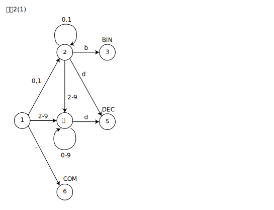
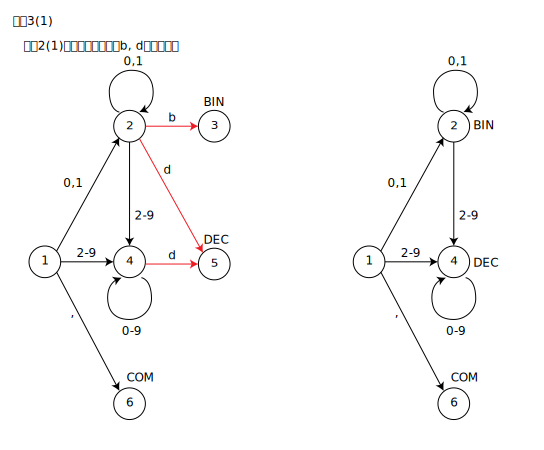

# 3章 字句解析
## 問題1

P.47の図をなぞっていく。
LFの意味を理解するのに若干時間がかかったが、P.49を読めばわかる。
トークンになる状態に遷移したらLFを更新して、状態が0になった時のLFがそれまでスキャンした字句のトークンになる。

^を教科書通りかけないので、 
: = posLF,LF 
' = posLF 
. = LF 
とする。 

状態    |LF     |入力列の状態   |注釈
--      |--     |--           |--
1       |0      |:2 . . 2    |
14      |14     | 2:. . 2    |
13      |13     | 2 .:. 2    |
13      |13     | 2 .:. 2    | 終了????

 

状態    |LF     |入力列の状態   |注釈
--      |--     |--           |--
1       |0      |:. . 2    |
15      |0      | .:. 2    |
15      |0      | .:. 2    | 終了????

## 問題2

(1)

## 問題3

(2)

