# 7章 上向き構文解析

## 章のまとめ

```
非終端記号Xに相当する部分の解析の途中で、αまで解析してYβが残っている状態を以下の記号で表す。
[X -> α ● Yβ]

Yβの解析を行うには、Y -> γの解析をする必要があり(すなわち([Y -> ●γ])、
[X -> α ● Yβ]は、[Y -> ●γ]を暗に含んでいる。
この関係を↓を使って荒rわす。
[X -> α ● Yβ]↓[Y -> ●γ]
```

```
例えば、以下の例だと、

0: Z -> Stmt EoF
1: Stmt -> EX Exp 
2: Exp -> NUM

[Z -> ● Stmt EoF]↓[Stmt -> ● EX Exp]
[Stmt -> EX ● Exp]↓[Exp -> ● NUM]
```

LR(0)のオートマトンは、
- 入力記号の最左を終端記号にしてスタックに積む(シフト)、
- スタックの中身を構文規則に則って非終端記号にしてスタックから取り出す(還元)
を行う。

マーカ(●)が、終端記号の直前に現れたらシフト、マーカが規則の右辺末尾に現れたら還元する。


```
LR(0) : 全ての終端記号で還元する。
SLR : Follow集合の終端記号で還元する。
LR(1) : 終端記号によって還元する構文規則を変える。

SLRは、一つだけ先読みしているから、SLR(1)だが、2,3で使うことがないのでSLRと表記される。
```


## 問題1

図7.3 入れ子を成す整数の並びを表す文法
```
0: Z -> List EoF
1: List -> LPAR Seq RPAR
2: List -> NUM
3: Seq -> List
4: Seq -> Seq COMMA List
```


表7.3 LR(0)の構文解析表
|     | NUM  | COMMA | LPAR | RPAR | EoF  | List | Seq  |
| --- | ---- | ----- | ---- | ---- | ---- | ---- | ---- |
| 1   | S(0) |       | S(5) |      |      | S(2) |      |
| 2   |      |       |      |      | A    |      |      |
| 3   | R[3] | R[3]  | R[3] | R[3] | R[3] |      |      |
| 4   | R[2] | R[2]  | R[2] | R[2] | R[2] |      |      |
| 5   | S(4) |       | S(5) |      |      | S(3) | S(7) |
| 6   | S(4) |       | S(5) |      |      | S(8) |      |
| 7   |      | S(6)  |      | S(9) |      |      |      |
| 8   | R[4] | R[4]  | R[4] | R[4] | R[4] |      |      |
| 9   | R[1] | R[1]  | R[1] | R[1] | R[1] |      |      |


終端記号列 (入力)
```
LPAR LPAR NUM RPAR COMMA NUM RPAR EoF
```

|     | 状態スタック                  | 入力記号の残り                        |
| --- | ----------------------------- | ------------------------------------- |
| 1   | 1                             | LPAR LPAR NUM RPAR COMMA NUM RPAR EoF |
| 2   | 1 LPAR 5                      | LPAR NUM RPAR COMMA NUM RPAR EoF      |
| 3   | 1 LPAR 5 LPAR 5               | NUM RPAR COMMA NUM RPAR EoF           |
| 4   | 1 LPAR 5 LPAR 5 NUM 4         | RPAR COMMA NUM RPAR EoF               |
| 5   | 1 LPAR 5 LPAR 5               | List RPAR COMMA NUM RPAR EoF          |
| 6   | 1 LPAR 5 LPAR 5 List 3        | RPAR COMMA NUM RPAR EoF               |
| 7   | 1 LPAR 5 LPAR 5               | Seq RPAR COMMA NUM RPAR EoF           |
| 8   | 1 LPAR 5 LPAR 5 Seq 7         | RPAR COMMA NUM RPAR EoF               |
| 9   | 1 LPAR 5 LPAR 5 Seq 7 RPAR 9  | COMMA NUM RPAR EoF                    |
| 10  | 1 LPAR 5                      | List COMMA NUM RPAR EoF               |
| 11  | 1 LPAR 5 List 3               | COMMA NUM RPAR EoF                    |
| 12  | 1 LPAR 5                      | Seq COMMA NUM RPAR EoF                |
| 13  | 1 LPAR 5 Seq 7                | COMMA NUM RPAR EoF                    |
| 14  | 1 LPAR 5 Seq 7 COMMA 6        | NUM RPAR EoF                          |
| 15  | 1 LPAR 5 Seq 7 COMMA 6 NUM 4  | RPAR EoF                              |
| 16  | 1 LPAR 5 Seq 7 COMMA 6        | List RPAR EoF                         |
| 17  | 1 LPAR 5 Seq 7 COMMA 6 List 8 | RPAR EoF                              |
| 18  | 1 LPAR 5                      | Seq RPAR EoF                          |
| 19  | 1 LPAR 5 Seq 7                | RPAR EoF                              |
| 20  | 1 LPAR 5 Seq 7 RPAR 9         | EoF                                   |
| 21  | 1                             | List EoF                              |
| 22  | 1 List 2                      | EoF                                   |


## 問題2

```
LR状態Siから、LR状態Sjへ張られた有効枝は高々1本であることを示せ
```


$$
LR状態S_iから、Aを読んで遷移するLR状態は、\\
goto(I,A) = \{[X \rightarrow \alpha A ● \beta] | [X \rightarrow \alpha ● A \beta]\}

　\\
　\\
　\\

Bを読んで遷移するLR状態は、\\
goto(I,B) = \{[X \rightarrow \alpha B ● \beta] | [X \rightarrow \alpha ● B \beta]\}
$$

で、先読み記号が変わればGOTOが変わる。


## 問題3 

図7.8の文法
``` 
0: Z -> Seq EoF
1: Seq -> ε
2: Seq -> NUM Seq
```

### 検討用にLRオートマトンも記載


LRオートマトンの解析表は、以下？([Seq -> ●]の還元でぶつかる、でよい？)
|     | NUM  | EoF  | Seq        |
| --- | ---- | ---- | ---------- |
| 1   | S(3) |      | S(2)       |
| 2   |      | A    |
| 3   | S(3) |      | S(4), R[1] |
| 4   | R[2] | R[2] |
 

### SLRオートマトン



|     | NUM  | EoF  | Seq  |
| --- | ---- | ---- | ---- |
| 1   | S(3) | R[1] | S(2) |
| 2   |      | A    |
| 3   | S(3) | R[1] | S(4) |
| 4   |      | R[2] |


```
NUM NUM EoF
```

|     | 状態スタック  | 入力記号の残り |
| --- | ------------- | -------------- |
| 1   | 1             | NUM NUM EoF    | シフト |
| 2   | 1 NUM 3       | NUM EoF        | シフト |
| 3   | 1 NUM 3 NUM 3 | EoF            | シフト |
| 4   | 1 NUM 3       | Seq EoF        | 還元   |
| 5   | 1 NUM 3 Seq 4 | EoF            | シフト |
| 6   | 1             | Seq EoF        | 還元   |
| 7   | 1 2           | EoF            | シフト |


## 問題4 

``` 
0: Z →　Input EoF
1: Input → Seq
2: Seq → ε
3: Seq → LPAR Seq RPAR
```

(1)
LR(0)オートマトン


状態4で、LPARで、Seqの還元とS(4)への遷移で衝突があるため、LR(0)文法ではない。


(2)
SLRオートマトン


状態4のSeqの還元と、S(4)の遷移の衝突を、Seqの還元は先読み記号がEoF/RPARの時のみに限定することで回避できるため、SLR(0)文法である。


## 問題5

```　　　　　　　　　
0: Z → Input EoF
1: Input → Seq
2: Seq → ε
3: Seq → EX Seq EX
4: Seq → QU Seq QU
```

(1)
SLRオートマトン


状態1,4,7で、シフト/還元衝突が発生している。


(2)


# 8章 構文解析器生成系yacc

サポートページに記載があるが、yacc記述のtoken定義は、","が不要で、スペースでよい。

[サポートページ](https://www.saiensu.co.jp/search/?isbn=978-4-7819-1205-9&y=2008#support)

## 問題1 

左再帰的な文法の場合、還元が逐次行われるためスタックが一定数を超えず、
左再帰的でない文法の場合、入力記号の終わりから還元をするため、スタックが増える。


## 問題2

作成したyacc記述は以下。lexは、教科書のものを用いる[sample.l](./chapt7,8/sample.l)。

```
%token INT  FLOAT  ID  NUM  REAL  COMMA  EQ  EX  QU  SEMI  ADD  SUB  MUL  DIV  LPAR  RPAR  ERROR;

%%
Program     : Exp {}
Exp         : Exp ADD Term {}
            | Exp SUB Term {}
            | Term {}
Term        : Term MUL Factor {}
            | Term DIV Factor {}
            | Factor {}
Factor      : ID {}
            | NUM {}
            | LPAR Exp RPAR {}
%%
#include "lex.yy.c"
int main(){
    if(!yyparse()) printf("successfully ended\n");
}
int yyerror(char* s){printf("%s\n", s); return -1;}
```

```sh
lex sample.l
yacc e8-2.y
gcc y.tab.c
echo "100 * 100" | ./a.out 
# successfully ended
echo "(1*2)+10" | ./a.out 
# successfully ended
```


