# 2 
## 2.1

strtolのmanページに記載のサンプルコードを流用する．

[addition.c](./chap02/addition.c)

```sh
gcc addition.c -o addition
 ./addition 10 20 
# 10 + 20 = 30
./addition 10 0x
# Further characters after number: x
echo $?
# 1 
./addition 0x 10
# Further characters after number: x
echo $?
# 1 
./addition 1000000000000000000000 10 
# strtol: Numerical result out of range
echo $? 
# 1
```

エラー判定の例で，manページ記載の例の意図がよくわからなかった．例示用で大きな意味はないと思うが．

```c
           if ((errno == ERANGE && (val == LONG_MAX || val == LONG_MIN))
                   || (errno != 0 && val == 0)) {
               perror("strtol");
               exit(EXIT_FAILURE);
           }

    /*
    (errno == ERANGE && (val == LONG_MAX || val == LONG_MIN))
    -> errnoがERANGEなら，valの判定は不要では？

    (errno != 0 && val == 0)
    -> errorが非0なら，val=0をみなくてよいのでは？
    */

```


# 3 

P.27の3.5章の，1行ずつ読み書きする(fgetc, fputc)が，fgets, fputsの誤植．

## 3.1 

[mycp.c](./chap03/mycp.c)

```sh
gcc mycp.c -o mycp 
./mycp source.txt dest.txt 
diff source.txt dest.txt 
chmod 000 dest.txt 
./mycp source.txt dest.txt 
# dest.txt: Permission denied
chmod +w dest.txt 
chmod +r dest.txt 
./mycp source.txt dest.txt 
chmod 000 source.txt 
./mycp source.txt dest.txt 
# source.txt: Permission denied
```


fgetsで，
- size - 1を最大で読む．
- newline, EOFにぶつかったらそこでいったんバッファに入れる

という記載になっており，実際，手元環境では一行がsizeより大きくても動作し，教科書の記載と異なる．あれ？

```
       fgets()  reads in at most one less than size characters from stream and stores them into the buffer pointed to by s.  Reading stops after an EOF or a newline.  If a newline is read, it is stored into the buffer.  A terminating null byte ('\0') is stored after the last character in
       the buffer.
```

## 3.2 

教科書の記載からは，読み込みにはfgetsを使うのを求められているように思える(fscanfは使ってはいけない？)．

[read_profile.c](./chap03/read_profile.c)

```sh
gcc read_profile.c -o read_profile
./read_profile profile.csv 
# [NO.0]
#   name=Tomoko Tanaka
#   age=19
# [NO.1]
#   name=Miya Sakaiaka
#   age=21
# [NO.2]
#   name=Ayane Yamamoto
#   age=20
```

# 4 

## 4.1 

[savelist_binary.c](./chap04/savelist_binary.c)


[readlist_binary.c](./chap04/readlist_binary.c)

```sh
gcc readlist_binary.c -o readelist_binary 
./readelist_binary 
# [No.0] name=Takako Toyota, age=25, height=163.419998
# [No.1] name=Mizuho Kagami, age=21, height=155.889999
# [No.2] name=Yoshie Tanaka, age=25, height=168.229996
# [No.3] name=Mai Nobe, age=22, height=145.889999
```

## 4.2 

[savearray.c](./chap04/savearray.c)

確認用にインクリメントデータを書き出し．

```sh
gcc savearray.c -o savearray 
./savearray 
ll
# -rw-r--r-- 1 hish hish 500000 Feb 26 07:44 array.bin
od -t x4 array.bin | head 
# 0000000 00000000 00000001 00000002 00000003
# 0000020 00000004 00000005 00000006 00000007
# 0000040 00000008 00000009 0000000a 0000000b
# 0000060 0000000c 0000000d 0000000e 0000000f
# 0000100 00000010 00000011 00000012 00000013
# 0000120 00000014 00000015 00000016 00000017
# 0000140 00000018 00000019 0000001a 0000001b
# 0000160 0000001c 0000001d 0000001e 0000001f
# 0000200 00000020 00000021 00000022 00000023
# 0000220 00000024 00000025 00000026 00000027
```


## 4.3 

[pickvalue.c](./chap04/pickvalue.c)

```sh
gcc pickvalue.c -o piclvalue
./piclvalue array.bin 0 0 0 
# The value of (0 0 0) is 0
./piclvalue array.bin 1 0 0 
# The value of (1 0 0) is 1
./piclvalue array.bin 0 1 0 
# The value of (0 1 0) is 50
./piclvalue array.bin 0 0 1 
# The value of (0 0 1) is 2500
```


# 5 

## 5.1 

- [copy_lowio.c](./chap05/copy_lowio.c)
- [copy_highio.c](./chap05/copy_highio.c)


```sh
gcc copy_lowio.c -o copy_lowio 
gcc copy_highio.c -o copy_highio

head -c 10485760  /dev/random > source.bin  # 10MB
./copy_lowio source.bin dest.bin 
# Elapsed Time: 9.452412
./copy_highio source.bin dest.bin 
# Elapsed Time: 0.161717
```

約上が1MB/sec, 下が61MB/sec


## 5.2, 5.3

以下前提で書く．
- コピーするサイズは，バッファサイズで割り切れるサイズ
- ソースファイルが標準入力等で，readでEOF前に読み出しサイズより小さいサイズで読まれることはない．


(1) : [copy2_lowio.c](./chap05/copy2_lowio.c)
(2) : [copy2_highio.c](./chap05/copy2_highio.c)


```c
//読書会にて指摘あり．以下のコードで，上記制約必要なくなるだろう，と．．．おっしゃるトオリッス＞＜

while ((sz = read(fdin, buf, COPYSIZE)) > 0) {
        write(fdout, buf, sz);     /* COPYSIZEバイト書き込む */
    }
```


(3)(4), 5.3

|                    | 1        | 256      | 512      | 1024     | 2048     | 4096     | 8192     | 16384    | 
|---                 |---       |---       | ---      | ---      | ---      | ---      | ---      | ---      | 
|low                 | 9.452412 | 0.038471 | 0.020762 | 0.012332 | 0.007921 | 0.006206 | 0.006908 | 0.006658 |
|high                | 0.161717 | 0.008908 | 0.007262 | 0.007453 | 0.007027 | 0.006091 | 0.007163 | 0.006343 | 
|high(setvbuf 4096)  | 0.162471 | 0.007075 | 0.006514 | 0.006200 | 0.006765 | 0.005627 | 0.006128 | 0.006848 |      


(5)
- リード転送要求を開始してからデータを受け取るまでのレイテンシを比較した場合，ストレージアクセスとメモリアクセスではストレージアクセスの方がこのレイテンシが長い．また，このレイテンシは通常一回の転送の大きさが支配的ではなく，ディバイスの特性や内部バスの調停によるレイテンシが支配的になる．このため，バッファリングの大小によらずにレイテンシは似たような値になる．
このため，バッファリングを大きくすることで，ストレージアクセスの回数が減り，データ1byteに対するレイテンシペナルティを小さくすることができる．バッファリングが2048~4096から，速度改善が見られないのは，ストレージアクセスにおける一回の転送の最大サイズが，4096付近になっていることによると思われる．

## 5.3 

計測結果は上記の表．

私の環境だと，DEFAULTのバッファサイズ(stdio.hのBUFSIZ)は8192... 
上記の説明が，，，，よくわからん．

期待される回答は，バッファサイズまでは改善傾向，バッファサイズになったらサチる．


# 6

lstatは，Symbolic Linkそのものの情報を返し，statをSymbolic Link先の情報を返す．fstatは，descriptorが引数になる．

## 6.1 

- [getperm.c](./chap06/getperm.c)

st_modeの下位0bit目から，9bit分をアクセス権と決めつけて書いている．
ここが前提におけない場合は，st_mode & ~S_IFMTで，アクセス権を取り出した後に，
S_IFMTのleading zeroを数えないといけないが，それはしてない．

```sh
gcc getperm.c -o getperm 
./getperm getperm
# For user : read write execute
# For group : read  execute
# For others : read  execute
```

## 6.2 

- [filelist2.c](./chap06/filelist2.c)

```sh
gcc filelist2.c -o filelist2
./filelist2 .
#getperm@
#filelist2@
#getperm.c@
#filelist2.c@
#a.out@
#../
#./
```


# 7

## 7.1 

~/course/2010/sysproに実体をおいて,
~/sysproへsym linkを張ればよい．

```sh

ln -s ~/course/2010/syspro ~/syspro

```

## 7.2 

d_namlenで，最後尾の文字を手に入れようと思ったが，メンバにおらず．strlenを使う．

- [rmbfile.c](./chap07/rmbfile.c)

```sh
touch piyo~
touch hoge~
gcc rmbfile.c  -o rmbfile 
./rmbfile . 
#        Do you remove the file piyo~ ?[y/n/q]y
#        Do you remove the file hoge~ ?[y/n/q]y
ls
# a.out  rmbfile  rmbfile.c
```


## 7.3 

- [trash.c](./chap07/trash.c)


## 7.4 

getmntinfoは．linuxにおらず，本問パス．


# 8 

## 8.1 

(1)

コード中でアドレスをダンプすると以下．(16進数16桁の64bitにするために，%16lxにしている)
- [genstring.c](./chap08/genstring.c)

```
----- variables(gen_string) ------
array        :    7fff1279d200
i            :    7fff1279d1fc
----- functions(gen_string) ------
gen_string   :    55737b8192c9
----- variables(main) ------
str          :               0
----- functions(main) ------
gen_string   :    55737b8192c9
printf       :    7f30d9b00e10
getchar      :    7f30d9b2a6e0
main         :    55737b8191e9
input any key
```

これを図示すると以下，，，だが，教科書との差分あり．
図が間違ってるので差し替え。




(2)
関数内のローカル変数は，スタック領域に確保され，関数を抜けるときに，スタックフレームが開放される．
そのため，mainでは，genstringから0ポインタが返される．

(3)

以下案が考えられるが，heap領域で行った．
- genstring関数内でheap領域を確保する
- mainで確保したpointerを渡してそこを上書く
- global変数として確保する
- 関数内でstatic変数として確保する．

なお，8個要素のcharで，NULL文字入れてない．

[genstring.c](./chap08/genstring2.c)


# 9 

## 9.1
- [toobigarray](./chap09/toobigarray.c)

Segmentation faultが発生した．

intが32bitとして，

(1500000 + 1000000 + 1 ) * 8 / 1024/1024 = 約9.53MByte

ulimit -s は，8192なので，これを超えている．


## 9.2

256文字チェックをするように変更．

- [buf_problem.c](./chap09/buf_problem.c)


# 10 

## 10.1 

bash中でbashを動かしてから，ps -lをする．

```sh
ps -l 
# F S   UID   PID  PPID  C PRI  NI ADDR SZ WCHAN  TTY          TIME CMD
# 0 S  1000   171    32  0  80   0 -  2560 do_wai pts/3    00:00:00 bash
# 0 S  1000  8665   171  0  80   0 -  2502 do_wai pts/3    00:00:00 bash
# 0 S  1000  8687  8665  0  80   0 -  2502 do_wai pts/3    00:00:00 bash
# 0 R  1000  8745  8687  0  80   0 -  2635 -      pts/3    00:00:00 ps
```

## 10.2 

for文の前に，waitを入れる．

- [serialize_process.c](./chap10/serialize_process.c)


```sh
[BEFORE FORK]
 Process ID : 8228       Parent Process ID : 171
[AFTER FORK]
 Process ID : 8228       Parent Process ID : 171
[id=8228] Return Value of Fork : 8229

[AFTER FORK]
 Process ID : 8229       Parent Process ID : 8228
[id=8229] Return Value of Fork : 0

(8229) for loop i=0
(8229) for loop i=1
(8229) for loop i=2
(8229) for loop i=3
(8229) for loop i=4
(8229) End the child process
(8228) for loop i=0
(8228) for loop i=1
(8228) for loop i=2
(8228) for loop i=3
(8228) for loop i=4
(8228) End the parent process
```

## 10.3 

単純にfor文の中でforkすると，親プロセスが生成するfor文の中のプロセスと，子プロセス自分のfor文以降で生成する子プロセスが生成されてしまう．
子プロセスの場合は生成しないように以下のようにする．親，子プロセスは，変数をpを別に用意した．

for(i=0;i<mul_num && (ret[i] = fork()) > 0;i++);

- [multiparallel.c](./chap10/multiparallel.c)


```
[BEFORE FORK]
 Process ID : 8964       Parent Process ID : 171
[AFTER FORK]
 Process ID : 8964       Parent Process ID : 171
[id=8964] Return Value of Fork : 8965
[id=8964] Return Value of Fork : 8966

[AFTER FORK]
 Process ID : 8965       Parent Process ID : 8964
[id=8965] Return Value of Fork : 0
[id=8965] Return Value of Fork : 0

[AFTER FORK]
 Process ID : 8966       Parent Process ID : 8964
[id=8966] Return Value of Fork : 8965
[id=8966] Return Value of Fork : 0

(8964) for loop i=0
(8964) for loop i=1
(8964) for loop i=2
(8964) for loop i=3
(8964) for loop i=4
(8964) End the parent process
(8965) for loop i=0
(8965) for loop i=1
(8965) for loop i=2
(8965) for loop i=3
(8965) for loop i=4
(8965) End the child process
(8966) for loop i=0
(8966) for loop i=1
(8966) for loop i=2
(8966) for loop i=3
(8966) for loop i=4
(8966) End the child process
```

# 11


# 14

## 14.1

```sh
>> cat /etc/services 
ftp-data        20/tcp
ftp             21/tcp
fsp             21/udp          fspd
ssh             22/tcp                          # SSH Remote Login Protocol
telnet          23/tcp
smtp            25/tcp          mail
http            80/tcp          www             # WorldWideWeb HTTP
```

## 14.2 

